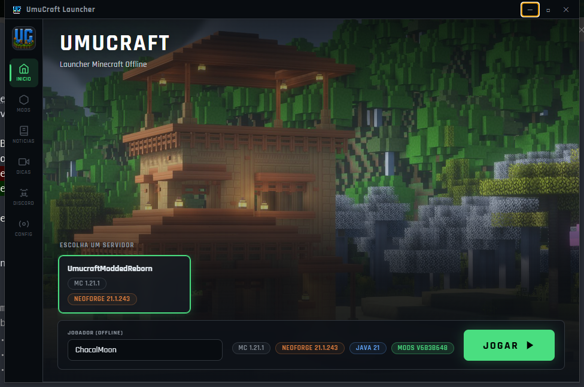
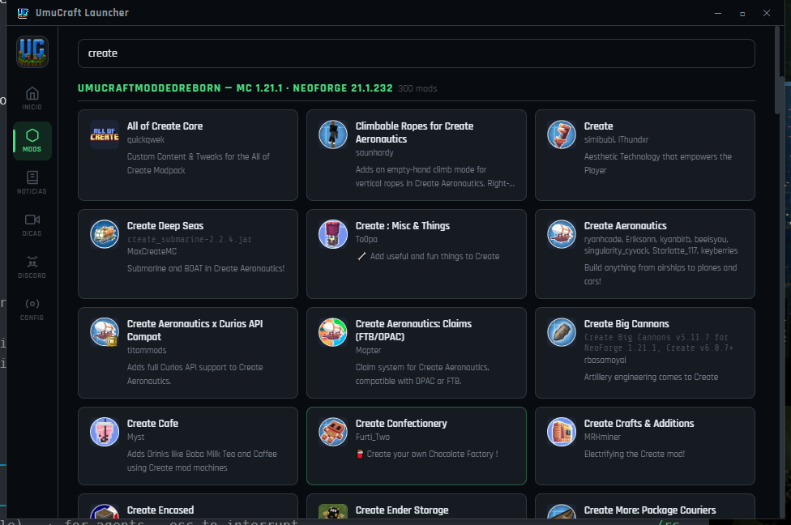

<div align="center">
  

  # UmuCraft Launcher

  **O jeito fácil de jogar no UmuCraft.** Baixa, abre, clica em JOGAR.

  [](https://github.com/andrecodato/UmucraftLauncher/releases/latest)
  [](https://github.com/andrecodato/UmucraftLauncher/releases/latest)
  [](#)
  [](#)
</div>

---

<div align="center">
  
</div>

## O que é isso?

Um launcher próprio pra galera do UmuCraft jogar Minecraft com modpack sem
dor de cabeça. Sem precisar instalar Java, sem precisar saber o que é Forge
ou NeoForge, sem precisar configurar nada — o launcher resolve tudo sozinho
e te avisa quando sai mod novo.

## 🚀 Como jogar

1. Baixe o instalador na [página de releases](https://github.com/andrecodato/UmucraftLauncher/releases/latest) (`.exe`)
2. Instale normalmente (próximo, próximo, concluir)
3. Abra o launcher — ele detecta e baixa o Java sozinho na primeira vez
4. Escolha seu nickname, clique no servidor que quer jogar, e clique em **JOGAR**

Pronto. Da segunda vez em diante é só abrir e jogar — mods e atualizações
chegam sozinhos.

## ✨ O que o launcher faz por você

- **Java automático** — detecta e instala a versão certa, sem downloads manuais
- **Mods sempre atualizados** — quando sai mod novo no servidor, o launcher baixa sozinho na próxima vez que você abrir
- **Vários servidores, uma conta só** — cada servidor guarda seus próprios mods separados; trocar de servidor não bagunça nada
- **Se atualiza sozinho** — sem precisar baixar instalador novo toda vez

<div align="center">
  
</div>

## ❓ Perguntas frequentes

**Preciso instalar o Forge/NeoForge/Fabric na mão?**
Não, o launcher cuida disso sozinho.

**Como troco de servidor?**
Clica no card do servidor que quiser na tela inicial. Cada um mantém seus próprios mods.

**Onde entro no Discord da comunidade?**
Tem um botão dedicado na aba Discord do launcher.

---

<details>
<summary><strong>📖 Documentação técnica (contribuidores e admins do servidor)</strong></summary>

## Estrutura do Projeto

```
src/
├── main/                          # Processo principal (Electron/Node.js - CommonJS)
│   ├── index.js                   # Entry point — lifecycle do app + bootstrap
│   ├── state.js                   # Estado compartilhado (mainWindow, javaPath, etc.)
│   ├── preload.js                 # Bridge IPC para janela principal
│   ├── bootstrap-preload.js       # Bridge IPC para janela de bootstrap
│   ├── bootstrap/                 # Sistema de detecção/instalação do Java
│   │   ├── controller.js          #   Máquina de estados (detect → install → validate)
│   │   ├── detector.js            #   Detecção de executáveis Java
│   │   ├── installer.js           #   Download/extração do Adoptium JDK
│   │   └── logger.js              #   Log de bootstrap + eventos IPC
│   ├── ipc/                       # Handlers IPC separados por domínio
│   │   ├── windowIpc.js           #   Minimize, maximize, close
│   │   ├── bootstrapIpc.js        #   Retry, open-logs
│   │   ├── configIpc.js           #   Load/save config.json
│   │   ├── launcherIpc.js         #   Fetch manifest, sync-and-launch
│   │   ├── serverIpc.js           #   Ping de servidores MC
│   │   └── utilIpc.js             #   Open folder, open external, browse dir, system info
│   ├── services/                  # Lógica de negócio pura
│   │   ├── profileService.js      #   Criação do perfil padrão + download do client MC
│   │   ├── manifestService.js     #   Fetch do manifest remoto
│   │   ├── modSyncService.js      #   Sincronização de mods (download zip + verificação MD5 + extração)
│   │   ├── versionInstaller.js    #   Client vanilla + import do version.json do loader (Forge/NeoForge/Fabric)
│   │   ├── minecraftLauncher.js   #   Resolução de Java + spawn do Minecraft
│   │   └── serverPingService.js   #   Ping TCP do protocolo MC
│   ├── utils/                     # Utilitários reutilizáveis
│   │   ├── paths.js               #   BASE_DIR, constantes, ensureDirectories
│   │   ├── ipcSender.js           #   send() e log() para o renderer
│   │   ├── download.js            #   Download de arquivos com progresso
│   │   ├── concurrency.js         #   Pool de downloads paralelos
│   │   ├── http.js                #   HTTP GET JSON com redirect
│   │   └── fileHash.js            #   Hash MD5 de arquivos
│   └── windows/                   # Criação de janelas
│       ├── mainWindow.js          #   Janela principal (960×640)
│       └── bootstrapWindow.js     #   Janela de bootstrap (520×400)
│
├── renderer/                      # Interface do usuário (ES Modules)
│   ├── index.html                 # Shell HTML com 6 abas
│   ├── bootstrap.html             # HTML da janela de bootstrap
│   ├── bootstrap-renderer.js      # Lógica da janela de bootstrap
│   ├── helpers.js                 # $(), logLine(), escapeHtml()
│   ├── app/
│   │   └── init.js                # Entry point — inicialização da UI
│   ├── store/
│   │   └── state.js               # Estado reativo (config, manifest, sysInfo)
│   ├── data/                      # Dados estáticos
│   │   ├── tips.js                #   Dicas/vídeos
│   │   └── discord.js             #   Link do Discord
│   ├── services/                  # Comunicação com o main process
│   │   ├── configService.js       #   Apply/collect config da UI
│   │   ├── manifestClient.js      #   Fetch + populate manifest na UI + cards de servidor
│   │   └── ipcBridge.js           #   Listeners de eventos IPC
│   ├── components/                # Componentes reutilizáveis
│   │   ├── titlebar.js            #   Barra de título (minimize/maximize/close)
│   │   ├── sidebar.js             #   Navegação lateral de abas
│   │   ├── loadingOverlay.js      #   Overlay de carregamento
│   │   └── profileCard.js         #   Card de servidor/perfil (create/update, ping ao vivo)
│   ├── pages/                     # Lógica por aba
│   │   ├── homePage.js            #   Home — launch, username
│   │   ├── modsPage.js            #   Mods — lista completa por modpack, com busca
│   │   ├── newsPage.js            #   Noticias — posts do manifest.news
│   │   ├── tipsPage.js            #   Dicas — grid por categoria
│   │   ├── discordPage.js         #   Discord — botão de convite
│   │   └── settingsPage.js        #   Config — RAM, diretório, Java
│   └── styles/                    # CSS modular
│       ├── variables.css           #   Custom properties (cores, fontes, dimensões)
│       ├── base.css                #   Reset, scrollbar, empty state, status dot
│       ├── loading.css             #   Overlay de carregamento
│       ├── titlebar.css            #   Barra de título
│       ├── sidebar.css             #   Sidebar de navegação
│       ├── layout.css              #   Content area + tabs
│       ├── home.css                #   Hero, badges, launch, progress
│       ├── forms.css               #   Inputs, selects, sliders, botões
│       ├── mods.css                #   Grid de mods
│       ├── profileCards.css        #   Cards de servidor/perfil (Home)
│       ├── news.css                #   Cards de notícias
│       ├── tips.css                #   Cards de dicas
│       ├── discord.css             #   Página do Discord
│       └── settings.css            #   Formulário de configurações
│
└── assets/                        # Ícones do app
    └── icon.png / icon.ico / large_icon.png / server-icon.png / banner_1.jpg
```

### ⚙️ Setup para admins do servidor

#### 1. Instalar dependências

```bash
npm install
```

#### 2. Configurar a URL do manifesto

Edite `src/main/utils/paths.js`, objeto `CONFIG`:

```js
const CONFIG = {
  MANIFEST_URL: 'https://SUA_URL/manifest.json',
  DEFAULT_PROFILE: 'Default',
};
```

**Opções de hospedagem:**
- **Raspberry Pi self-hosted (recomendado):** veja `deploy/pi-server/README.md` — Samba + watcher automático + Cloudflare Tunnel. Depois de configurado, atualizar mods vira só arrastar `.jar` numa pasta de rede (zero passos manuais de zip/manifest/upload).
- **Dropbox:** Crie um link de compartilhamento e troque `?dl=0` por `?dl=1`
- **GitHub Raw:** `https://raw.githubusercontent.com/usuario/repo/main/manifest.json`
- **Servidor próprio:** Qualquer URL HTTP/HTTPS pública

#### 3. Configurar servidores

Cada servidor é uma entrada em `profiles` no `manifest.json`. Adicione `host`/`port` por perfil (veja a estrutura completa abaixo).

#### 4. Criar o pacote de mods (.zip)

1. Coloque todos os `.jar` de mods numa pasta
2. Compacte tudo num `.zip` (ex: `mods.zip`)
3. Suba o `mods.zip` no **Dropbox** e pegue o link compartilhável (troque `?dl=0` por `?dl=1`)

#### 5. Gerar o manifest.json

```bash
node scripts/generate-manifest.js ./mods.zip "https://www.dropbox.com/scl/fi/XXX/mods.zip?rlkey=YYY&dl=1"
```

Isso gera o `manifest.json` com a versão, link do Dropbox e MD5 do zip. Pra especificar versão e perfil:

```bash
node scripts/generate-manifest.js ./mods.zip "URL_DROPBOX" ./manifest.json "Default" "1.0.1"
```

Esse script só cuida do zip de mods — `loader`/`loaderVersion`/`host`/`port` você edita direto no `manifest.json` (ou deixa o watcher do Pi preencher `loader`/`loaderVersion`, veja `deploy/pi-server/README.md`).

### 🔄 Como atualizar mods

**Opção recomendada (self-hosted no Pi):** veja `deploy/pi-server/README.md`. Você arrasta a pasta do modpack (mods + `instance.json` exportado do ATLauncher) pra um drive de rede, e o watcher zipa os mods, importa a versão/loader e a lista completa de mods do `instance.json`, e publica tudo sozinho.

**Manual (Dropbox/GitHub):**
1. Atualize os `.jar` na sua pasta de mods, compacte num novo `mods.zip`, suba no Dropbox
2. Rode o script com uma versão nova:
   ```bash
   node scripts/generate-manifest.js ./mods.zip "URL_DROPBOX" ./manifest.json "Default" "1.0.1"
   ```
3. Faça push do `manifest.json` atualizado

### 🏗️ Estrutura do manifest.json

```json
{
  "serverName": "Meu Servidor",
  "description": "Descrição que aparece no launcher",
  "tags": ["NeoForge 1.21.1", "Survival"],

  "profiles": {
    "Nome do Perfil": {
      "minecraftVersion": "1.21.1",
      "loader": "neoforge",
      "loaderVersion": "21.1.233",
      "javaMajor": 21,
      "host": "mc.meuserver.com",
      "port": 25565,
      "versionJsonUrl": "https://SUA_URL/profiles/Nome%20do%20Perfil/version.json",
      "versionJsonMd5": "hash_md5_do_version_json",
      "modsVersion": "1.0.0",
      "modsZipUrl": "https://www.dropbox.com/scl/fi/.../mods.zip?rlkey=...&dl=1",
      "modsZipMd5": "hash_md5_do_zip",
      "modsListUrl": "https://SUA_URL/profiles/Nome%20do%20Perfil/mods-list.json",
      "modsListMd5": "hash_md5_da_lista"
    }
  },

  "news": [
    {
      "title": "Título da notícia",
      "date": "2024-03-10",
      "tag": "update",
      "pinned": true,
      "body": "Texto da notícia"
    }
  ]
}
```

- `loader`: `"vanilla"`, `"forge"`, `"neoforge"` ou `"fabric"`. Para vanilla, omita `loaderVersion`/`versionJsonUrl`/`versionJsonMd5`.
- `loader`, `loaderVersion`, `javaMajor`, `versionJsonUrl`, `versionJsonMd5`, `modsListUrl` e `modsListMd5` são preenchidos automaticamente pelo watcher do Pi a partir de um `instance.json` do ATLauncher (veja `deploy/pi-server/README.md`) — só `host`/`port` são configurados à mão.
- `modsListUrl` aponta pra um JSON com nome, versão, autor, ícone e descrição de cada mod (usado na aba Mods do launcher) — gerado a partir do `launcher.mods` do `instance.json`.
- `host`/`port`: endereço do servidor Minecraft, mostrado no card do launcher com ping ao vivo.

**Tags de notícia disponíveis:** `update`, `maintenance`, `event`, `info`

### 🔄 Auto-update do launcher

O launcher em si (não só os mods) se atualiza sozinho via `electron-updater`. Pra publicar uma versão nova:

1. Bump o campo `version` em `package.json`, commit
2. Crie e dê push numa tag igual à versão: `git tag v1.0.1 && git push origin v1.0.1`
3. O GitHub Actions builda o `.exe` e publica como GitHub Release; o Pi detecta a release nova e publica sozinho no feed — veja `deploy/pi-server/README.md`

`npm run publish-launcher` continua disponível como atalho manual (builda local e sobe via SSH na hora, sem esperar o Actions).

### 🔨 Build (gerar instalador)

```bash
npm run build         # Windows
npm run build:linux   # Linux (AppImage)
npm run build:mac     # macOS (dmg)
```

O instalador será gerado na pasta `dist/`.

### 🛠️ Desenvolvimento

```bash
npm run dev     # electron . --dev (com DevTools)
npm start       # electron .
```

### ☕ Java automático

| Minecraft | Java |
|-----------|------|
| 1.17–1.19 | Java 17 |
| 1.20–1.21 | Java 21 |

### 📁 Pastas de dados (`%APPDATA%/.UmuCraft/`)

| Pasta | Conteúdo |
|-------|---------|
| `java/` | Java gerenciado pelo launcher (Adoptium JDK) |
| `versions/` | Versões do Minecraft/loader (client jars + JSONs) — **compartilhado entre servidores** |
| `libraries/` | Bibliotecas do Minecraft/loader — **compartilhado** |
| `assets/` | Assets do Minecraft — **compartilhado** |
| `instances/<servidor>/` | Mods + config **isolados por servidor** (trocar de servidor não apaga o outro) |
| `cache/` | Manifest/mods-list em cache (offline fallback) |
| `logs/` | Logs (bootstrap.log) |
| `config.json` | Configurações do player (username, RAM, servidor selecionado) |

Instalações antigas (`~/.UmuCraft`, antes da v1.0.1) são migradas automaticamente na primeira abertura — nada se perde.

### 🏛️ Arquitetura

- **Main Process** (CommonJS): `index.js` → `windows/` → `ipc/` → `services/` → `utils/`
- **Renderer** (ES Modules): `app/init.js` → `pages/` → `components/` + `services/` → `store/` + `data/`
- **IPC Bridge**: `preload.js` expõe `window.launcher.*` com métodos seguros via `contextBridge`
- **Estilos**: CSS modular importado no `index.html`

Detalhes de infra do servidor (Pi, Samba, nginx, Cloudflare Tunnel, painel admin, releases automatizadas) ficam em `deploy/pi-server/README.md`. Práticas de git/versionamento/release ficam em `CLAUDE.md`.

</details>
